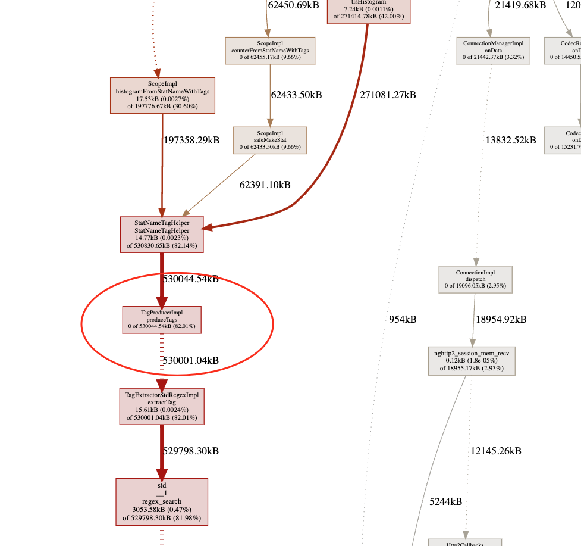
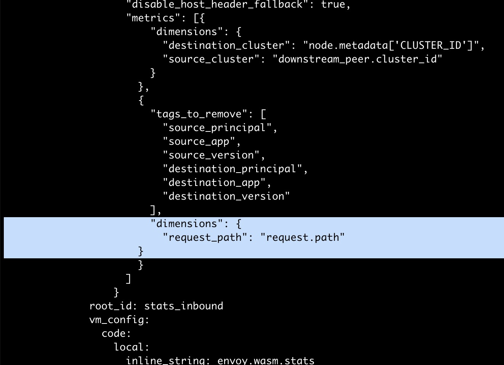

## 故障现象

Envoy 内存快速增长，不久后即内存溢出，导致 Pod 不断重启。导出 heap 并通过 pprof 查看，发现内存中有大量 Stat Tag 相关的对象。



## 故障原因

Envoy 中 Stats Tag 用于 Metrics 上报，因此怀疑是对 metrics 的改动导致了该问题。 查看 Istiod 的 EnvoyFilter stats-filter-1.12，发现该 EnvoyFilter 中为 metrics 增加了一个 dimension ```request_path:request.path```，如下图中高亮部分所示。该配置表示在 metrics 中新增一个 tag，取值为 HTTP 请求 Header 中的 path 字段。 由于该服务请求中 path 字段包含了用户 token 等变量，导致 path 的取值范围很广，导致 envoy 中的 metrics 实例数量暴增，最终导致内存溢出。



## 解决方案

在 EnvoyFilter 中去掉 request_path dimension，该问题即可解决。

该故障的经验教训：为 istio 数据面 metrics 增加 tag 时需要特别注意，不要随意加入取值范围较大，特别是取值为离散值的 tag。这会导致 metrics 占用的内存数量成倍增长。 例如增加一个取值范围为 10 的 tag，理论上就会导致 metrics 占用的内存增加 10 倍。