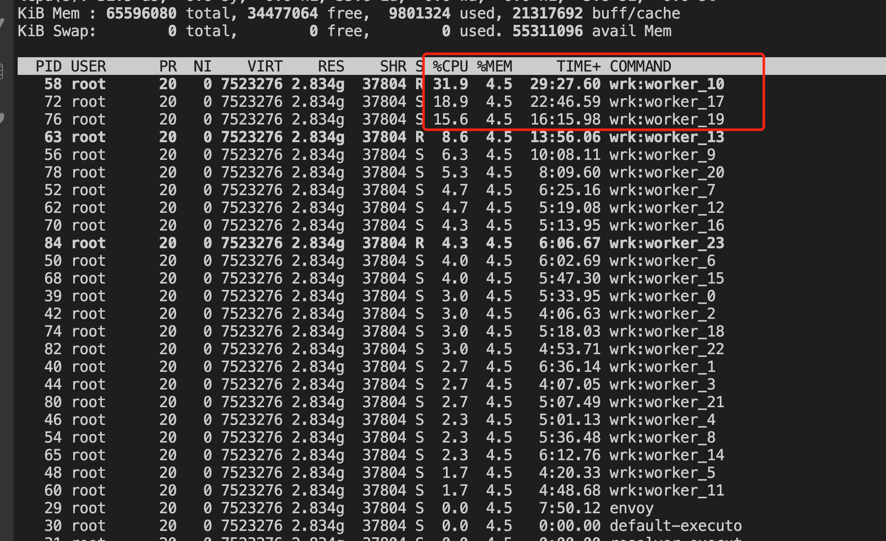
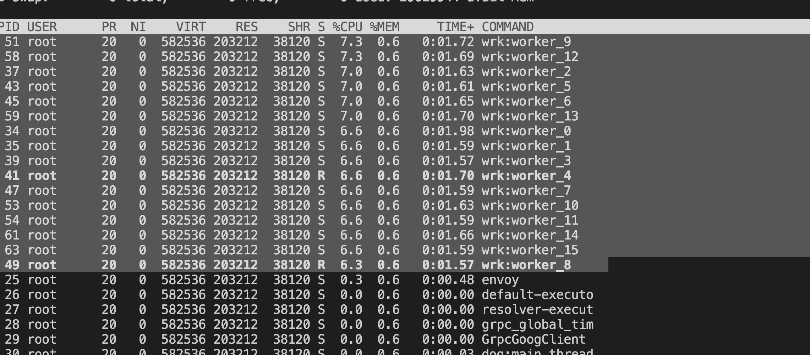

## 故障现象

Envoy 进程使用的多个 CPU 之间的工作负载不均衡。如下图所示，Ingress Gateway 中一共有 24 个 Worker，但只有三个 worker 的 CPU 使用率较高，其他 CPU 使用率很低。

出现该问题后，虽然 CPU 还有空闲，但会由于 Envoy 的处理能力不足而导致请求积压，请求时延变长，甚至请求超时。




## 故障原因

该问题是 [Envoy 的线程模型](https://blog.envoyproxy.io/envoy-threading-model-a8d44b922310) 导致的。 Envoy 采用多个 worker 线程（一般和 CPU core 数量相同）来接收并处理来自 downstream 的链接。一个链接创建后，该链接后面的所有处理只在一个 worker 线程中进行处理。这种线程模型保证了一个链接中的业务处理都是单线程的，简化了代码的处理逻辑。

缺省情况下，Envoy 不会在多个 worker 线程之间对链接数量进行均衡。在大部分 upstream 链接都是短链接的情况下，操作系统可以很好地将链接比较均匀地分配到多个 worker 线程上。但是，在长链接的情况下（例如 HTTP2/GRPC），多个 worker 线程分配到的链接数量可能不够均匀，就会出现有的 CPU 使用率高，有的 CPU 使用率低的情况。

## 解决方案

Envoy 在 [listener](https://www.envoyproxy.io/docs/envoy/latest/api-v3/config/listener/v3/listener.proto) 的配置中提供了一个 [```connection_balance_config```](https://www.envoyproxy.io/docs/envoy/latest/api-v3/config/listener/v3/listener.proto#envoy-v3-api-msg-config-listener-v3-listener-connectionbalanceconfig) 选项来强制在多个 worker 线程之间对链接进行均匀分配。

对于大量长链接的情况，可以采用 EnvoyFilter 来启用```connection_balance_config```。 下面的 EnvoyFilter 为 Ingress Gateway 启用了 worker 链接均衡功能。

```yaml
apiVersion: networking.istio.io/v1alpha3
kind: EnvoyFilter
metadata:
  name: ingress-envoy-listener-balance
  namespace: istio-system
spec:
  workloadSelector:
    labels:
      istio: ingressgateway
  configPatches:
  - applyTo: LISTENER
    match:
      context: GATEWAY
    patch:
      operation: MERGE
      value:
        connection_balance_config:
          exact_balance: {}
```

启用上面的配置后，可以看到各个 CPU 的使用率基本相同。


注意事项：
* 如果一个 Listener 通过设置 ```use_original_dst``` 将所有链接都交给其他 Listener 处理，则建议不要在该 Listener 上设置 ```connection_balance_config```，以避免在该 Listener 上引入额外的开销。这种情况下，应该在真正处理链接的 Listener 上设置该选项。参见 [Envoy 文档中的说明](https://www.envoyproxy.io/docs/envoy/latest/api-v3/config/listener/v3/listener.proto)。
* 在对链接进行 balancing 时，会在多个 worker 线程中引入一个共享锁，因此对 Envoy 创建链接的性能可能会有一定影响。 