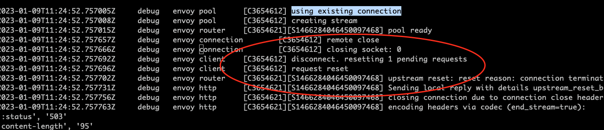

## 故障现象

客户端直接访问服务器正常，但在 service mesh 中经过 envoy 访问服务器则会出现一定几率的 503 错误。查看客户端侧 envoy 的访问日志，发现日志中有下面的异常信息：

```bash
[2023-01-05T04:21:37.764Z] "POST /foo/bar" 503 UC upstream_reset_before_response_started{connection_termination} - "-" 291 95 0 - "116.211.195.11,116.211.195.11" "Mozilla/5.0 (Macintosh; Intel Mac OS X 10_15_7) AppleWebKit/537.36 (KHTML, like Gecko) Chrome/108.0.0.0 Safari/537.36" "06a39679-a8d4-47f7-baf3-d688ea3e67c4" "foo.bar.com" "30.183.173.155:1984" outbound|1984||foor-service.bar-ns.svc.cluster.local 30.169.11.123:46894 30.169.11.123:443 116.211.195.11:21663 - -
```

## 故障原因

从访问日志中 `503 UC upstream_reset_before_response_started{connection_termination}` 的输出，我们可以初步推断出 503 的原因是连接被 upstream 侧中断了。

通过 Envoy 管理端口打开 debug 日志，可以看到在出现 503 UC 时，envoy 从 connection pool 中拿出了一个 upstream 的连接，但拿出该连接后，envoy 打印了一个 "remote close" 日志，说明该连接被对端关闭了。



Envoy 的 HTTP Router 会在第一次和 Upstream 建立 TCP 连接并使用后将连接释放到一个连接池中，而不是直接关闭该连接。这样下次 downstream 请求相同的 Upstream host 时可以重用该连接，可以避免频繁创建/关闭连接带来的开销。 

但在某些情况下，服务器端主动关闭了连接，而 Envoy 侧尚未感知到该连接的状态变化，就会导致 Envoy 将该连接从连接池中取出以用于发送来自 downstream 的请求。此时就会出现 `503 UC upstream_reset_before_response_started{connection_termination}` 异常。

## 解决方案

### 方案一

增大服务器端 TCP keepalive timeout 的时间间隔可以减少该问题出现的几率。该问题在 nodejs 应用中出现得较多，原因是 [nodejs 的缺省超时时间较短，只有 5 秒钟](https://nodejs.org/api/http.html#serverkeepalivetimeout)，因此在 Envoy 连接池中取出的连接有较大几率刚好被对端的 nodejs 应用关闭了。

> Timeout in milliseconds. Default: 5000 (5 seconds).
The number of milliseconds of inactivity a server needs to wait for additional incoming data, after it has finished writing the last response, before a socket will be destroyed. If the server receives new data before the keep-alive timeout has fired, it will reset the regular inactivity timeout, i.e., server.timeout.

通过下面的方法可以在服务器端将 nodejs 的 keepalive tiemout 时间延长为 6 分钟。

```node
const server = app.listen(port, '0.0.0.0', () => {
  logger.info(`App is now running on http://localhost:${port}`)
})
server.keepAliveTimeout = 1000 * (60 * 6) // 6 minutes
``` 

其他语言的设置方法：

Python
```python
global_config = {
  'server.socket_timeout': 6 * 60,
}
cherrypy.config.update(global_config)
```

Go
```go
var s = http.Server{
    Addr:        ":8080",
    Handler:     http.HandlerFunc(Index),
    IdleTimeout: 6 * time.Minute,
}
s.ListenAndServe()
```

### 方案二

通过方案一可以减少 503 UC 出现的频率，但理论上无论 keepalive timout 设置为多大，都有出现 503 UC的几率。而且我们也需要将 timeout 设置为一个合理的值，而不是无限大。要彻底解决该问题，可以采用 Virtual Service 为出现该问题的服务设置重试策略，在重试策略的 retryOn 中增加 `reset` 条件。

备注：
Istio 缺省为服务设置了重试策略，但缺省的重试策略中并不会对连接重置这种情况进行重试。

```yaml
apiVersion: networking.istio.io/v1alpha3
kind: VirtualService
metadata:
  name: ratings-route
spec:
  hosts:
  - ratings.prod.svc.cluster.local
  http:
  - route:
    - destination:
        host: ratings.prod.svc.cluster.local
        subset: v1
    retries:
      attempts: 3
      retryOn: reset,connect-failure,refused-stream,unavailable,cancelled,retriable-status-codes
```

## 参考文档

* [Istio: 503's with UC's and TCP Fun Times](https://karlstoney.com/2019/05/31/istio-503s-ucs-and-tcp-fun-times/)
* [Envoy intermittently responds with 503 UC (upstream_reset_before_response_started{connection_termination})](https://github.com/envoyproxy/envoy/issues/14981)
* [TCP-Keepalive-HOWTO](https://tldp.org/HOWTO/html_single/TCP-Keepalive-HOWTO/)
* [Istio Virtual Service Retry Policy](https://istio.io/latest/docs/reference/config/networking/virtual-service/#HTTPRetry)
