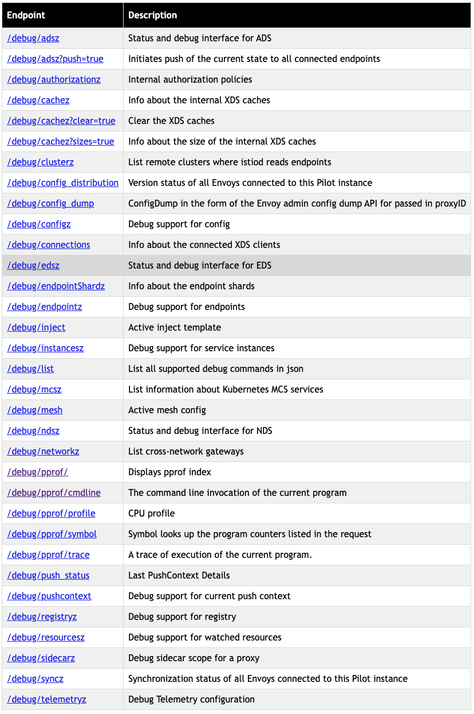
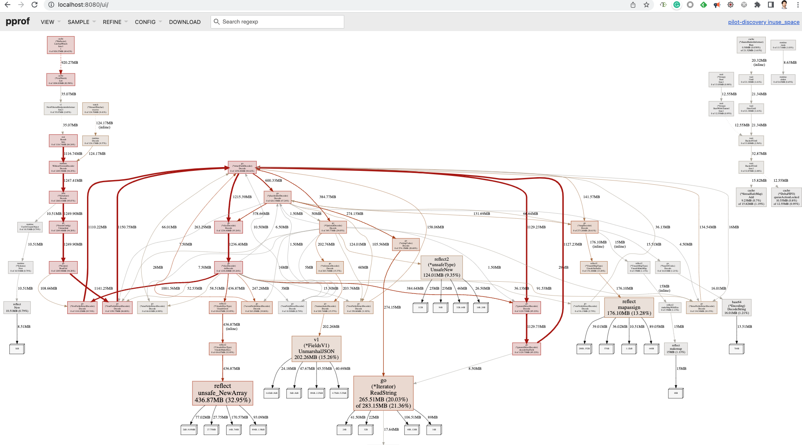

## Istio 调试接口

Istio 提供了一个调试端口 15014，通过该端口可以查看到 istiod 内部的大量调试信息，包括 istiod 的内存、cpu 使用情况，xds 缓存信息，连接到 istio 的代理，cluster 和 endpoint 信息等等。

可以通过下面的命令将 15014 端口 port forward 到 localhost：

```bash
k -n istio-system port-forward svc/istiod 15014
```

通过浏览器访问 ```http://127.0.0.1:15014/debug```， 可以看到调试端口支持获取的所有信息。



## 查看 istiod 内存占用

将 istio 调试端口 port forward 到 localhost 后，可以采用下面的命令分析 istiod 的内存使用情况：

```bash
go tool pprof -http=:8080 localhost:15014/debug/pprof/heap
```

该命令以 istio 调试端口输出的 heap 信息为输入，在 8080 端口上提供了 istiod 内存的详细分析。



